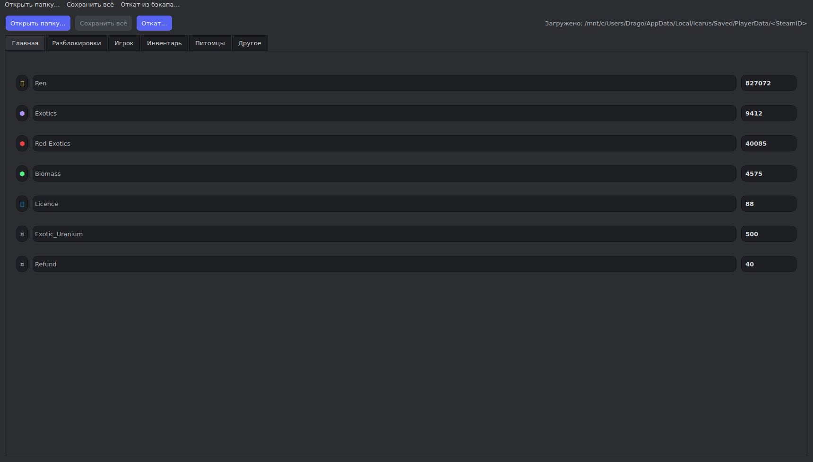
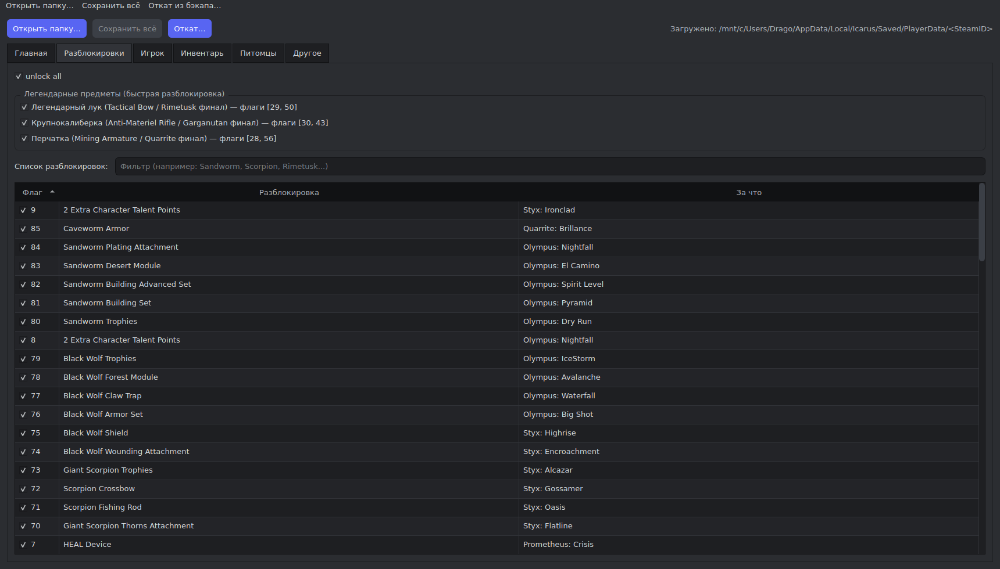
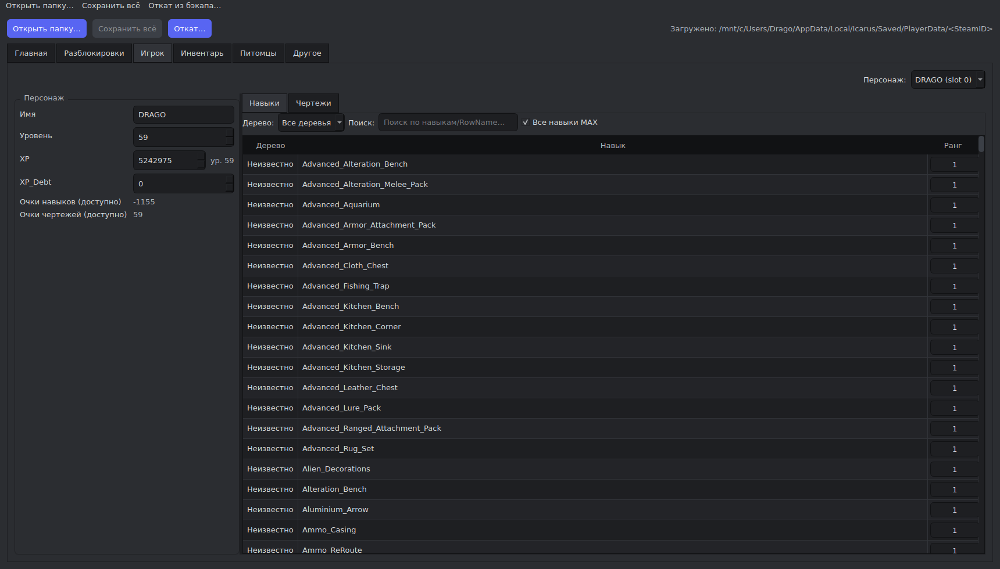
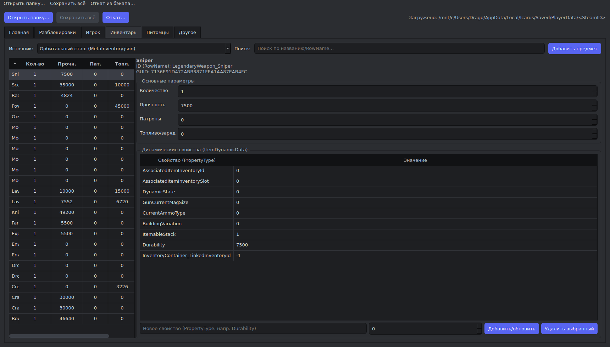
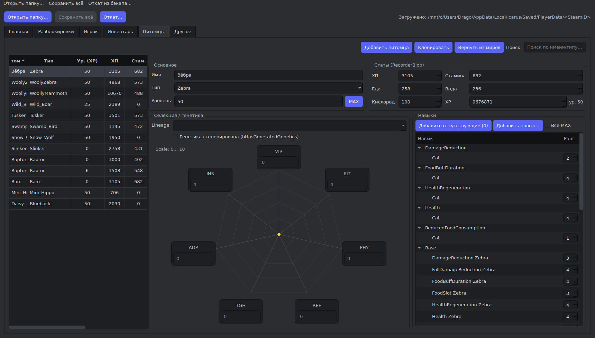
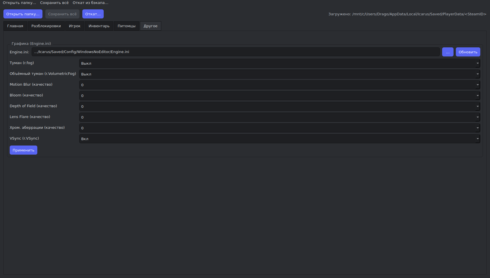

# Icarus Save Editor

Простой десктопный редактор сохранений для **Icarus** на `PySide6`. Программа помогает быстро править валюту, разблокировки, персонажей, инвентарь, питомцев и часть связанных игровых файлов без ручного редактирования JSON.

## Скриншоты

| Главная | Разблокировки |
| --- | --- |
|  |  |

| Игрок | Инвентарь |
| --- | --- |
|  |  |

| Питомцы | Другое |
| --- | --- |
|  |  |

## Функционал

- Автоматический поиск папки сохранений `PlayerData/<SteamID>` и ручное открытие нужного сейва.
- Редактирование валюты профиля: `Ren`, `Exotics`, `Red Exotics`, `Biomass` и других значений из сохранения.
- Управление разблокировками и быстрые пресеты для легендарных предметов.
- Редактирование персонажей: имя, уровень, `XP`, `XP_Debt`, таланты и чертежи.
- Открытие всех чертежей и прокачка навыков персонажа до максимума.
- Редактирование орбитального сташа, `Loadouts` и части предметов, связанных с мирами (`Prospects`).
- Добавление предметов и изменение их динамических параметров: количество, прочность, патроны, топливо и другие `ItemDynamicData`.
- Управление питомцами и маунтами: просмотр статов, клонирование, удаление, возврат из миров.
- Экспериментальные инструменты для инвентарей мира и кастомных питомцев.
- Быстрая правка графических параметров в `Engine.ini`.
- Автоматическое создание ZIP-бэкапов перед сохранением и откат из резервной копии.

## Запуск

```bash
pip install -r requirements.txt
python icarus_save_editor.py
```

Для пересоздания превью из интерфейса:

```bash
python tools/capture_previews.py
```

## Лицензия

Проект опубликован по лицензии `Apache-2.0`. Код можно копировать, изменять и распространять, но нужно сохранять указание автора, файл `NOTICE` и текст лицензии.
